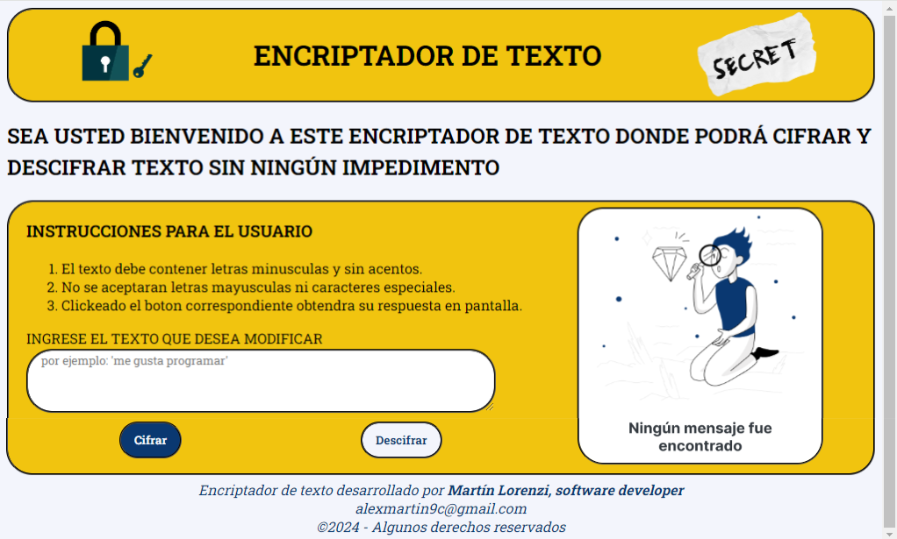

# Encriptador de Texto

Este encriptador de texto es una herramienta de cifrado y descifrado de texto desarrollado como parte de un desafío de Alura Latam en asociación con Oracle Education. Fue construido utilizando tecnologías frontend HTML, CSS, y JavaScript.

## Funcionalidades

El cifrado de texto posee un formato de encriptacion en el cual se busca remplazar las cinco vocales presentes en cada palabra por llaves de encriptación presentadas a continuación. 

- La letra **"e"** se convierte en **"enter"**
- La letra **"i"** se convierte en **"imes"**
- La letra **"a"** se convierte en **"ai"**
- La letra **"o"** se convierte en **"ober"**
- La letra **"u"** se convierte en **"ufat"**

El desifrado de texto funcióna de manera inversa siguiendo la misma logica del cifrado. Por otra parte una funcionalidad extra que ofrece este encriptador es la posibilidad de copiar el texto modificado mediante un boton de copiado que iteractua directamente con el portapapeles del sistema operativo gracias a la API de JavaScript y el metodo correspondiente. 

## Reglas de Encriptación

Para que la encriptación y desencriptación funcionen correctamente, el texto debe cumplir con las siguientes reglas:

1. **Solo letras minúsculas:** El texto debe estar compuesto únicamente por letras minúsculas.
2. **Sin acentos ni caracteres especiales:** No se deben utilizar letras acentuadas ni caracteres especiales sean mayusculas o minusculas.

## Instalación y disponibilidad de la pagina web

El acceso a la página web es publico y se brinda mediante los sistemas de alojamiento de Vercel y de GitHub pages que proporcionan links de facil acceso. La instalación es opciónal y se efectua clonando este repositorio en la computadora del usuario copiando el link indicado a continuación en una consola del sistema operativo como Git Bash Here o simbolo del sistema. 

- link del repositorio: https://github.com/07martin12/Challengue-EncriptadorDeTexto-AluraLatam-OracleEducation

Luego de clonar el repositorio el usuario debe entrar a la carpeta descargada y abrir finalmente el archivo index.html en el navegador web que este siendo utilizado. 

#link de vercel: https://challengue-encriptador-de-texto-alura-latam-oracle-education.vercel.app/
#link de github pages: https://07martin12.github.io/Challengue-EncriptadorDeTexto-AluraLatam-OracleEducation/

El diseño de la pagina web a sido adaptado tanto para computadoras como para mobiles y los diseños se muestran a continuación:

## Diseño PC

## Diseño Mobile
 
